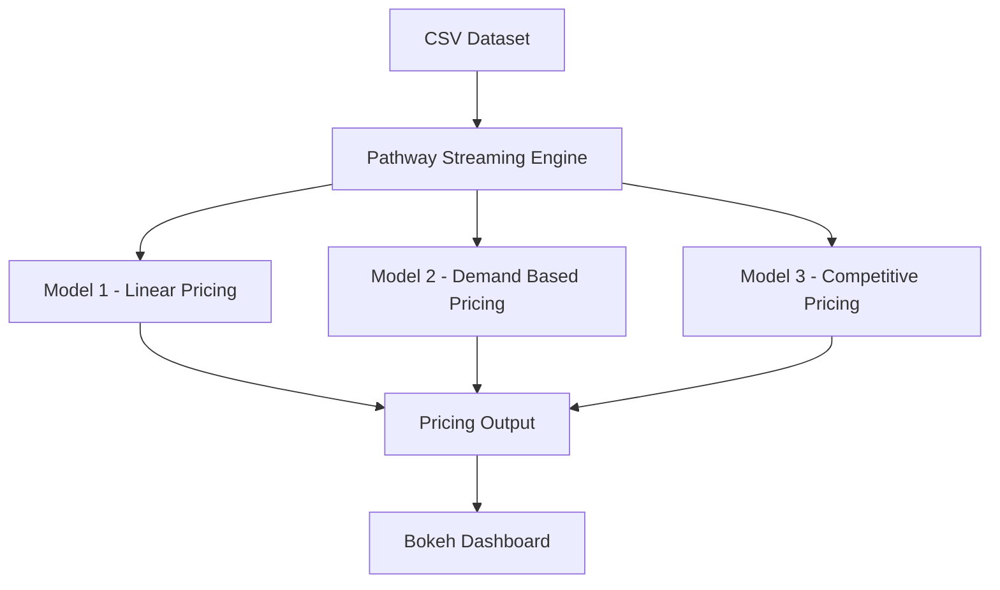

# Dynamic Pricing for Smart Parking using Pathway

## Overview

This project is a real-time dynamic pricing engine for smart parking systems. Using a live data stream, it simulates parking lot status and calculates optimal prices based on occupancy, demand, competition, and other real-world metrics. The project leverages **Pathway**, a real-time data processing engine, to demonstrate how dynamic pricing adapts on the fly for maximum efficiency and revenue.

---

## Tech Stack Used

- **Python 3**
- **Pathway** – for real-time data stream processing
- **Pandas / NumPy** – for data handling and computation
- **Bokeh** – for real-time visualizations
- **Jupyter Notebook / Google Colab** – for development and experimentation

---

## Architecture Diagram

---

## Project Architecture and Workflow (Explained)

### 1. **Data Ingestion**
The project starts by loading a CSV dataset containing simulated parking lot data. This includes fields like timestamp, occupancy, capacity, traffic condition, queue length, special event flag, and vehicle type. In a production setup, this would come from real-time IoT devices or traffic APIs.

### 2. **Streaming with Pathway**
Pathway is used to process this dataset as a simulated real-time stream. It performs:
- Timestamp parsing
- Day-level windowing using a **tumbling window**
- Data partitioning by parking lot
- Ensures exactly-once semantics

This turns static CSV into a stream-like processing pipeline that mimics a real-time environment.

### 3. **Pricing Models**

- **Model 1 – Linear Pricing:**  
  - Formula: `price = 10 + 10 * (occupancy / capacity)`
  - Increases price proportionally as the lot fills up.

- **Model 2 – Demand-Based Pricing:**  
  - Uses multiple parameters: traffic, queue length, special day, and vehicle type.
  - Calculates a composite **demand score**, and adjusts price using:  
    `price = base * (1 + λ * demand)`
  - Adds realism and dynamic behavior beyond occupancy.

- **Model 3 – Competitive Pricing (Planned):**  
  - Placeholder for future work where pricing also considers nearby lot prices.

### 4. **Daily Aggregation with Tumbling Window**
The data is grouped by day using Pathway’s temporal windowing. For each day, the pipeline calculates:
- Max & min occupancy
- Daily capacity
- Aggregated prices based on:
  - Max occupancy
  - Occupancy volatility (peak - min)

These help visualize how prices change in aggregate per day.

### 5. **Interactive Visualization Dashboard**
A dropdown-based dashboard using `ipywidgets` and `matplotlib` allows:
- Selection of parking lot
- Plotting both models over time
- Visual comparison of how demand and occupancy affect price

---

## Future Scope

- Add Model 3: Competitive pricing between nearby lots
- Integrate live traffic APIs (e.g., Google Maps)
- Build a full frontend with Plotly Dash or Streamlit
- Auto-tune pricing using reinforcement learning

---

## Getting Started

1. Open the notebook in **Google Colab**
2. Upload the dataset or use the GitHub-hosted raw URL
3. Run all cells step by step
4. Use the dropdown to select a lot and explore pricing

---

## Dataset Description

The dataset contains:
- `Timestamp`, `SystemCodeNumber`, `Occupancy`, `Capacity`
- `TrafficConditionNearby`, `QueueLength`, `IsSpecialDay`, `VehicleType`

The output pricing columns (`price_model1`, `price_model2`) are calculated during runtime using logic in the notebook.

---
